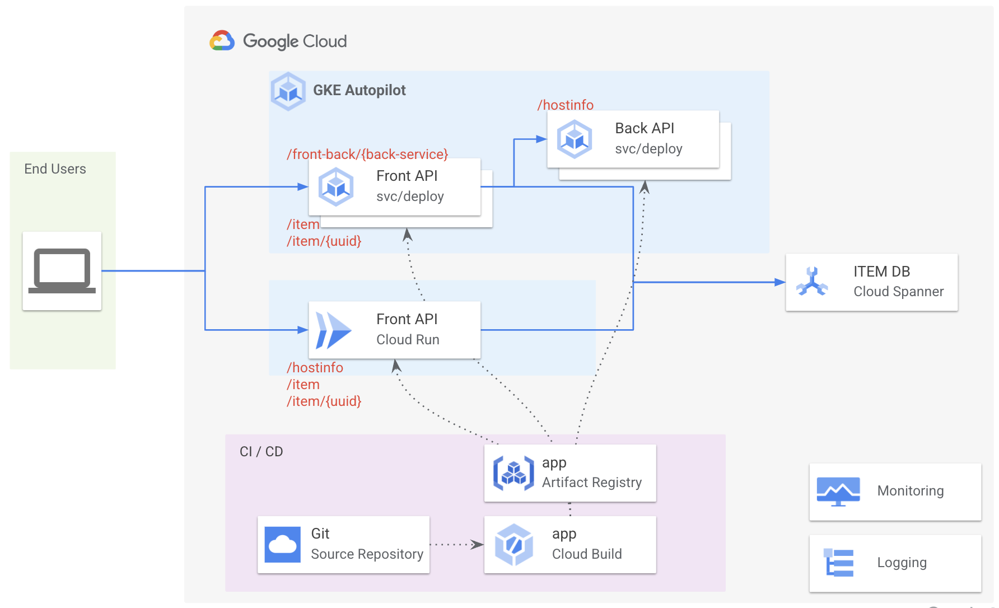

# アーキテクチャー概要

このサンプルでは以下のアーキテクチャーを想定したアプリケーションを提供する。


- 提供機能
  - マイクロサービスアーキテクチャー
    - サービス - サービス間の呼び出し
      - /fonrt-back/{back-service}
    - Spanner 呼び出し
      - /item
      - /item/{uuid}
    - コンテナ内で Pod や Cloud Run の情報取得
      - /hostinfo
  - 同じ機能を Cloud Run でも動かす
  - Git - Cloud Build - Artifact Registry 経由での CI/CD


開発アプリケーションとしては以下のフレームワークを想定する。
- JavaEE8 - OpenLiberty
- DB アクセスは JPA を利用

Spring Boot バージョンはこちら

Quarkus バージョンはこちら

# Cloud Run デプロイ手順
## プロジェクトの作成
新規のプロジェクトを作成し、開発メンバーなどにプロジェクトへの編集者権限を追加する。

## Spanner の作成
インスタンスを作成する。
 - インスタンス名: `noog`

データベースを作成する。
 - データベース名: `noogl`
 - Google 標準 SQL

テーブルを作成する。
```
CREATE TABLE ITEM (
 UUID STRING(36) NOT NULL,
 NAME STRING(60) NOT NULL,
 NAMEJP STRING(60),
 BREWERY STRING(40) NOT NULL,
 TYPE STRING(3),
 DIV STRING(3),
 ITEMNO INT64,
 PRICE NUMERIC,
 EXPLANATION STRING(256),
 REGDATE DATE,
 TIMEZONE STRING(32),
 TIMESTMP TIMESTAMP,
 VERSION TIMESTAMP,
) PRIMARY KEY(UUID);
```
サンプルデータを用意する。
```
INSERT INTO ITEM (UUID, NAME, NAMEJP, BREWERY, TYPE, DIV, ITEMNO, PRICE, EXPLANATION, REGDATE, TIMEZONE, TIMESTMP, VERSION)
VALUES
("4ac8a11e-8189-4037-88ec-093bd3c1e0ba", "Stone Happy 01.01.22", "ストーンハッピー０１．０１．２３", "Stone Brewery", "010", "100", 1111111111, 960.1, "My first item", "2021-12-15", "Asia/Tokyo", CURRENT_TIMESTAMP, CURRENT_TIMESTAMP),
("0084ee43-db66-460e-ba58-8182b154f3f8", "Space Delux", "スペース Delux", "Space Brewery", "020", "200", 2222222222, 860.1, "My second item", "2022-02-15", "Asia/Tokyo", CURRENT_TIMESTAMP, CURRENT_TIMESTAMP),
("1fb4d57c-0aa6-48db-bd88-4385e2bb7e30", "Stone Happy 31.09.22", "ストーンハッピー３１．１０．２２", "Stone Brewery", "030", "300", 3333333333, 860.1, "My third item", "2022-03-14", "Asia/Tokyo", CURRENT_TIMESTAMP, CURRENT_TIMESTAMP);
```

## サービスアカウントの作成
`spanner-client`という名でSpanner 接続用のサービスアカウントを作成する。(`spanner-client@{PROJECT_ID}.iam.gserviceaccount.com`)

`Cloud Spanner データベース ユーザー`という IAM ロールを付与する。

## ソースリポジトリの作成
https://github.com/junyakitady/gke-javaee/ をベースして、Github もしくは Source Repositiry にクローンを作成する。

## Artifact Registry の作成
Artifact Registry API と、脆弱性スキャンを有効にする。

新規のリポジトリを作成する。
- 名前 `app`
- 形式 `Docker`
- リージョン `asia-northeast1（東京）`

## Cloud Build　の設定
Cloud Build > トリガー より以下のトリガーを作成する。
- 名前 `gke-javaee-run`
- リージョン `asia-northeast1`
- リポジトリ: ソースを保持するリポジトリと連携させる
- ブランチ `develop`
- Cloud Build 構成ファイル `cloudbuild.yaml`
- 代入変数を追加 `TAG_NAME`:`latest`

## ビルドの実施
必要に応じてソースファイルの内容を更新し、commit & push を行う。

更新がない場合は、Cloud Build のトリガーより手動にてキックする。

## Cloud Run サービスの確認
ビルド完了後 Cloud Run サービスを確認する。

以下のオプションが設定されていることを確認する。
- Ingress `すべてのトラフィックを許可する`
- 認証 `未認証の呼び出しを許可`
- コンテナポート `9080`
- サービス アカウント `spanner-client`

Cloud Run サービスの URL を確認し、以下のパスに対して動作確認を行う。
- /hostinfo
- /item
- /item/{uuid}
